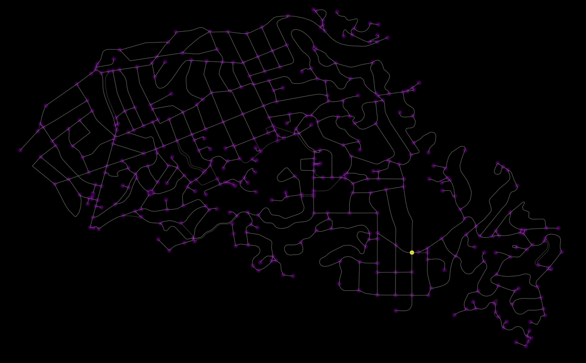

# Graph-Search-Algorithms

##### This is still the first draft of the code, it needs tons of refactoring. I'm just trying to get things going

#### working on the animations function now

## Algorithms Notebook

- [x] Depth First Search  

 
- [x] Breadth First Search
- [x] Dijkstra
- [ ] A*
- [ ] Branch price and cut
- [ ] Contraction Hierarchy

## Toy Problems Notebook

- [ ] Travelling Salesman Problem
- [ ] Minimum Spanning Tree
- [ ] Grid-based Motion Planning

## Case Study Notebook

- [ ] GIS Routing
